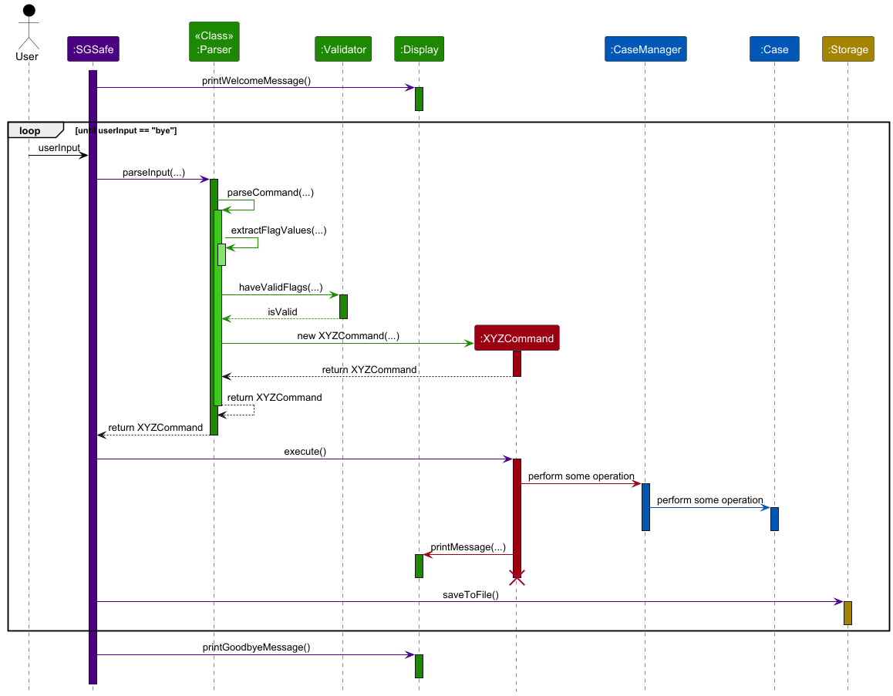
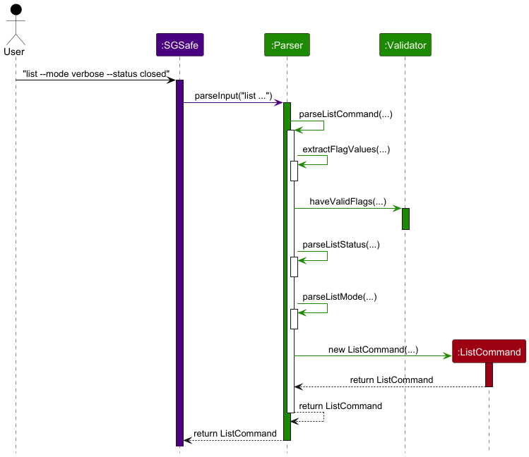

# Developer Guide

## Table of Contents

1. [Acknowledgements](#acknowledgements)
2. [Setting up, Getting Started](#setting-up-getting-started)
3. [Design](#design)
    - [Architecture](#architecture)
    - [UI Component](#ui-component)
    - [CaseFile Component](#casefile-component)
    - [Command Component](#command-component)
    - [Storage Component](#storage-component)
    - [Common](#common)
4. [Implementation](#implementation)
5. [Appendix A: Product Scope](#appendix-a-product-scope)
    - [Target user profile](#target-user-profile)
    - [Value proposition](#value-proposition)
6. [Appendix B: User Stories](#appendix-b-user-stories)
7. [Appendix C: Non-Functional Requirements](#appendix-c-non-functional-requirements)
8. [Appendix D: Glossary](#appendix-d-glossary)
9. [Appendix E: Instructions for Manual Testing](#appendix-e-instructions-for-manual-testing)

---

## Acknowledgements

{list here sources of all reused/adapted ideas, code, documentation, and third-party libraries -- include links to the
original source as well}

---

## Setting up, Getting Started

## Design

### Architecture

The Architecture Diagram given above explains the high-level design of the App.

Given below is a quick overview of main components and how they interact with each other.

#### Overall logic

The main code flow of `SGSafe`, our main class is as follows:
1. Print welcome message using `Display`
2. Initialize CaseManager with saved info from `data.txt` if it exists through `Storage`
3. Read user input from System.in
4. Parse user input using `Parser` and `Validator` to obtain a `Command` object that contains the information necessary to execute the specific command
5. Execute user command
6. Save the case info to `data.txt` using `Storage`
7. Until the command is to exit the program, repeat steps 3 to 6
8. Print exit message using `Display`

#### Overall sequence diagram
This is the overall sequence diagram, that will be elaborated more on in detail later. 
It describes the rough workflow of our app. 
Likewise, the abstract class `Command` mentioned here is meant to be a specific command, depending on what the user input is.

---

### UI Component
The UI component is responsible for all interactions with the user. It reads user input from the console and displays messages back to the user.

#### Key Classes

**Display**: Handles all user-facing output with formatted messages, including welcome/goodbye messages and command results.

**Validator**: Provides utility methods to validate flags, check required fields, and verify case ID format.

**Parser**: The parser class serves to determine the type of command object to create based on user input. The parser class extracts the keyword to identify the command type, then calls methods from `Validator` to check if the required arguments are present in the input.

Here are some examples of command keywords and their required arguments:
|keyword|Command Type|Required Arguments|
|-|-|-|
|add|AddCommand|`title`, `category`, `date`, `info`|
|read|ReadCommand||
|delete|DeleteCommand|`case id`|

#### Interaction Flow

1. `SGSafe.mainLoop()` reads user input from console
2. `Parser.parseInput()` extracts the command keyword from the input, then calls `Parser.parseXCommand()`, where X is the appropriate command type
3. `parseXCommand()`calls methods in `Validator` to check input validity, then creates the appropriate `XCommand` object to perform the action
4. Any exceptions caught or error messages are shown through `Display.printMessage()`
5. Results are also displayed via `Display.printMessage()`

##### Example Interaction Flow

The sequence diagram above illustrates how user input is processed to create and execute a `ListCommand`.

---

### CaseFile Component

The CaseFile component is in charge of how case records are stored, organized, and managed in SGSafe.
It acts as the main part of the system’s data model, defining what information each case contains and how cases are handled.
The component’s main functions are provided through the CaseManager class, which other parts of the 
system (like Command and Storage) use to access or update case data.

The API of this component is primarily specified in `CaseManager`.

#### Structure of the CaseFile Component

The CaseFile component consists of two main parts: `Case` and `CaseManager`.
Together, they represent the domain model for managing case records within the system.

The `Case` class defines the structure and behavior of individual cases, 
encapsulating shared attributes such as case ID, case title, case info etc.
Specialised subclasses (e.g., `FinancialCase`, `TrafficCase`, `ViolentCase`) 
extend `Case` to implement category specific attributes and methods.

The `CaseManager` class is responsible for managing `Case` objects.
It provides high-level operations such as adding, updating, deleting, and retrieving cases.

Additionally, `Case` interacts with the `CaseFormatter` class 
to produce formatted representations of case data for display.

#### Responsibilities

The CaseFile component:

- **Defines the abstract base class `Case`**, which encapsulates common attributes and behaviors for all case types
- **Provides extensibility** by allowing specialized case types to inherit from `Case`
- **Manages collections of cases** through `CaseManager`, which creates, retrieves, updates, and deletes cases
- **Coordinates persistence** by interacting with the `Storage` component to save and load case data
- **Supports command execution flows**, since `Command` objects often delegate work to `CaseManager` and its managed `Case` instances

#### Key Classes

**Case**:
An abstract class that defines the blueprint for all case types. 
It includes identifiers, metadata (e.g. time it is created at, time it is updated at, title, etc.), 
and abstract methods that must be implemented by subclasses (e.g. domain‑specific case types).

**CaseManager**:
A concrete class responsible for managing Case objects. 
It provides operations such as adding, updating, deleting, and retrieving cases. 
It also handles validation and persistence by coordinating with Storage.

#### Interaction Flow
1. A `Command.execute()` call triggers an operation on `CaseManager`
2. `CaseManager` locates or creates the appropriate `Case` object
3. The `Case` object performs domain‑specific logic or state changes
4. Results are returned to the Command, which then passes them to the UI for display

---

### Command Component

---

### Storage Component

The Storage component handles the saving and loading from a human editable text file for data persistence

The API of this component is primarily specified in `Storage`.

#### Responsibilities:

The Storage component:
- Handles the writing to and reading from the save file
- Adds saved case files to `CaseManager` on load

#### Interaction flow:

Loading from a save file:
- When the program starts, `loadCaseManager()` from the storage class is called to initialise the `CaseManager`
from `SGSafe.main()`

Saving to the save file:
- Every time a command completes, `saveToFile()` is run in the `SGsafe.handleUserCommand()` method.
This only occurs if the command is successfully run.

---

### Common

---

## Implementation

---

## Appendix A: Product scope

### Target user profile

- police officer who needs to manage a significant number of cases
- prefers desktop apps over other types of apps
- can type fast
- prefers typing to using the mouse
- comfortable using CLI apps

### Value proposition

- manage and track cases faster than a typical mouse/GUI driven app

---

## Appendix B: User Stories

Priorities: High (must have) - `* * *`, Medium (nice to have) - `* *`, Low (unlikely to have) - `*`

| Priorities | Version | As a ...           | I want to ...           | So that I can ...                                 |
|------------|---------|--------------------|-------------------------|---------------------------------------------------|
| ***        | v1.0    | front-desk officer | create case             | record cases into the system                      |
| ***        | v1.0    | front-desk officer | edit case details       | edit cases that are typed wrongly                 |
| ***        | v1.0    | front-desk officer | mark case as closed     | close cases that have been attended to            |
| ***        | v1.0    | front-desk officer | delete case             | delete duplicates                                 |
| ***        | v1.0    | front-desk officer | list all cases          | see all the cases that are currently being worked on |

---

## Appendix C: Non-Functional Requirements

- Should work on any mainstream OS as long as it has Java 17 or above installed.
- Should be able to hold up to 1000 cases without a noticeable sluggishness in performance for typical usage.
- A user with above average typing speed for regular English text (i.e. not code, not system admin commands) should be able to accomplish most of the tasks faster using commands than using the mouse.
{More to be added}

---

## Appendix D: Glossary

* *glossary item* — Definition

---

## Appendix E: Instructions for manual testing

{Give instructions on how to do a manual product testing e.g., how to load sample data to be used for testing}
